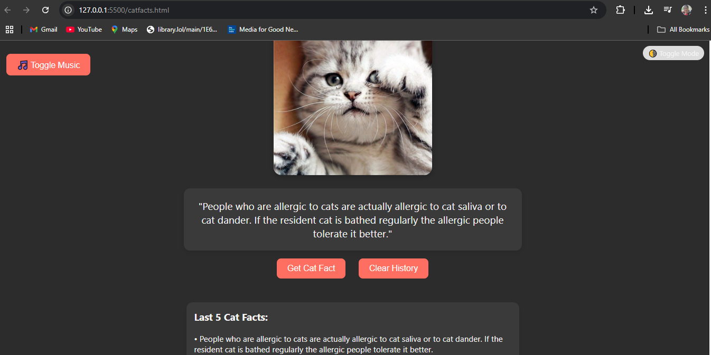

# Cat Facts Deluxe

**Cat Facts Deluxe** is a fun and interactive web project that displays random cat facts and images using public APIs. Built with HTML, CSS, and JavaScript, it includes background music, light/dark mode, animations, and local storage support.

## Features

- Random cat facts from [catfact.ninja](https://catfact.ninja/)
- Cat images from [The Cat API](https://thecatapi.com/)
- Background music with toggle
- Dark/Light mode toggle (saves your preference)
- Last 5 facts history stored using localStorage
- Animated UI and responsive design
- No frameworks – pure HTML, CSS, and JavaScript

## Live Demo

View it on GitHub Pages:  
[https://nisheeta13.github.io/cat-facts](https://nisheeta13.github.io/cat-facts)

## Screenshot

## Tech Stack

- HTML5
- CSS3 (Custom properties, transitions)
- JavaScript (Fetch API, localStorage, DOM manipulation)

## Folder Structure
cat-facts/
│
├── catfacts.html # Main HTML file
├── style.css # Styles (if separated)
├── script.js # JavaScript logic (if separated)
├── README.md # Project description
└── assets/ # Optional: images, music, icons

